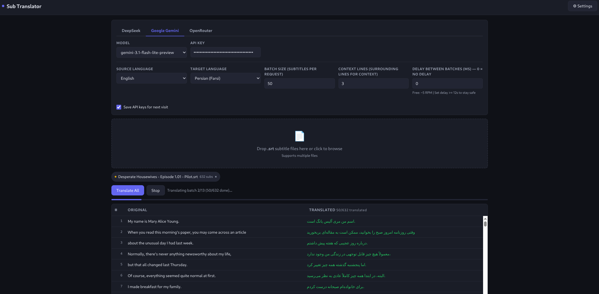

# Sub Translator

AI-powered SRT subtitle translation — right in your browser. Upload `.srt` files, pick a language, and translate with DeepSeek, Google Gemini, or OpenRouter.

**[Launch App →](https://rasoulnorouzi.github.io/sub_translator/)**

## Features

- Batch translate multiple `.srt` files at once
- Side-by-side preview of original and translated subtitles
- 15 languages supported
- Works fully client-side — API keys never leave your browser

## Getting an API Key

Choose one provider:

| Provider | Get Key | Notes |
|---|---|---|
| **DeepSeek** | [platform.deepseek.com](https://platform.deepseek.com) → API Keys | Best quality, paid (~$0.20/million tokens), no rate limits |
| **Google Gemini** | [aistudio.google.com](https://aistudio.google.com/apikey) | Free tier with rate limits (~5 RPM) |
| **OpenRouter** | [openrouter.ai](https://openrouter.ai/keys) | Free models available (20 RPM, 50 req/day) |

## Usage

1. Get an API key from one of the providers above
2. Open the [app](https://rasoulnorouzi.github.io/sub_translator/)
3. Click the **gear icon** to open settings
4. Select your provider, paste your API key, and pick a model
5. Upload `.srt` files, choose source/target languages, and hit **Translate**
6. Download translated files individually or as `.zip`
